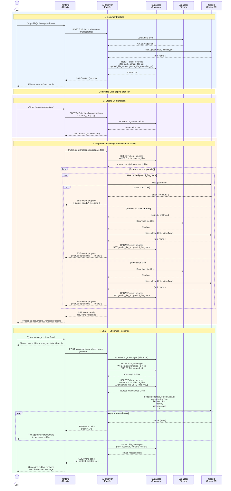

# Gemini File Lifecycle — Sequence Diagram

How documents flow from user upload through Gemini caching to streamed chat responses.

```mermaid
sequenceDiagram
    actor User
    participant Web as Frontend<br/>(React)
    participant API as API Server<br/>(Fastify)
    participant DB as Supabase<br/>(Postgres)
    participant Storage as Supabase<br/>Storage
    participant Gemini as Google<br/>Gemini API

    %% ── 1. Document Upload ──
    rect rgb(235, 245, 255)
    note over User,Gemini: 1. Document Upload
    User->>Web: Drops file(s) into upload zone
    Web->>API: POST /kb/clients/:id/sources<br/>(multipart file)
    API->>Storage: Upload file blob
    Storage-->>API: OK (storagePath)
    API->>Gemini: files.upload(blob, mimeType)
    Gemini-->>API: { uri, name }
    API->>DB: INSERT client_sources<br/>(file_path, gemini_file_uri,<br/>gemini_file_name, gemini_file_uploaded_at)
    DB-->>API: source row
    API-->>Web: 201 Created (source)
    Web-->>User: File appears in Sources list
    end

    note over User,Gemini: Gemini file URIs expire after 48h

    %% ── 2. Conversation Creation ──
    rect rgb(245, 240, 255)
    note over User,Gemini: 2. Create Conversation
    User->>Web: Clicks "New conversation"
    Web->>API: POST /kb/clients/:id/conversations<br/>{ source_ids: [...] }
    API->>DB: INSERT kb_conversations
    DB-->>API: conversation row
    API-->>Web: 201 Created (conversation)
    end

    %% ── 3. Prepare Files (SSE) ──
    rect rgb(255, 245, 235)
    note over User,Gemini: 3. Prepare Files (verify/refresh Gemini cache)
    Web->>API: POST /conversations/:id/prepare-files
    API->>DB: SELECT client_sources<br/>WHERE id IN (source_ids)
    DB-->>API: source rows (with cached URIs)

    loop For each source (parallel)
        alt Has cached gemini_file_name
            API->>Gemini: files.get(name)
            alt State = ACTIVE
                Gemini-->>API: { state: "ACTIVE" }
                API-->>Web: SSE event: progress<br/>{ status: "ready", fileName }
            else State != ACTIVE or error
                Gemini-->>API: expired / not found
                API->>Storage: Download file blob
                Storage-->>API: file data
                API->>Gemini: files.upload(blob, mimeType)
                Gemini-->>API: { uri, name }
                API->>DB: UPDATE client_sources<br/>SET gemini_file_uri, gemini_file_name
                API-->>Web: SSE event: progress<br/>{ status: "uploading" → "ready" }
            end
        else No cached URI
            API->>Storage: Download file blob
            Storage-->>API: file data
            API->>Gemini: files.upload(blob, mimeType)
            Gemini-->>API: { uri, name }
            API->>DB: UPDATE client_sources<br/>SET gemini_file_uri, gemini_file_name
            API-->>Web: SSE event: progress<br/>{ status: "uploading" → "ready" }
        end
    end

    API-->>Web: SSE event: ready<br/>{ fileCount, refreshed }
    Web-->>User: "Preparing documents..." indicator clears
    end

    %% ── 4. Chat with Streaming (SSE) ──
    rect rgb(235, 255, 240)
    note over User,Gemini: 4. Chat — Streamed Response
    User->>Web: Types message, clicks Send
    Web-->>User: Shows user bubble + empty assistant bubble
    Web->>API: POST /conversations/:id/messages<br/>{ content: "..." }
    API->>DB: INSERT kb_messages (role: user)
    API->>DB: SELECT kb_messages<br/>WHERE conversation_id = :id<br/>ORDER BY created_at
    DB-->>API: message history
    API->>DB: SELECT client_sources<br/>WHERE id IN (source_ids)<br/>AND gemini_file_uri IS NOT NULL
    DB-->>API: sources with cached URIs

    API->>Gemini: models.generateContentStream(<br/>  systemInstruction,<br/>  fileData URIs,<br/>  history,<br/>  user message<br/>)

    loop Async stream chunks
        Gemini-->>API: chunk { text }
        API-->>Web: SSE event: delta<br/>{ text: "..." }
        Web-->>User: Text appears incrementally<br/>in assistant bubble
    end

    API->>DB: INSERT kb_messages<br/>(role: assistant, content: fullText)
    DB-->>API: saved message row
    API-->>Web: SSE event: done<br/>{ id, content, created_at }
    Web-->>User: Streaming bubble replaced<br/>with final saved message
    end
```
